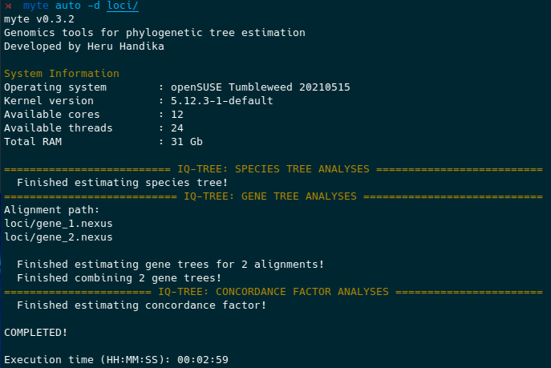

# myte


[](https://www.travis-ci.com/hhandika/myte)


The app is a wrapper for IQ-TREE and Astral. It allows to estimate species tree, gene trees, gene and site concordance factors, MSC Astral trees, and to organize resulting files using a single command:

```{Bash}
myte auto -d [gene-alignment-folder]
```

Similar functions can be achieved using a Bash script running GNU parallel. Our solution, however, carries some benefits:

1. No coding skills needed. The app is a single executable command line app. The way it is designed omits the need to change the code.
2. Reproducible. All code changes in the app are tracked using git. It also generates a log file when running.
3. Flexible. The app lets users to specify the analysis parameters. The app design allows current and future parameters available in the IQ-TREE and Astral.
4. Low footprint. It is written in a high-performance programming language with low ram and cpu usages.
5. Safe parallel processing. It takes the advantages of the Rust programming language parallel computing algorithms that avoid data races.

Limitation:

The app does not yet support MPI. It is designed to run in a desktop computer and take advantage of all the available cores in it when possible. It should work in a cluster computer just fine, but will be limited to a single CPU in a single node.

<p align="center">
 
</p>

## Installation

`myte` is a single executable command line app. The executable file will be available in the release [link](https://github.com/hhandika/myte/releases). Copy it to the folder that is registered in your PATH variable. For Linux users, if you encounter GLIBC erorrs when trying to run `myte`, try using the `ManyLinux` executable.

You can also install the app using the Rust package manager [cargo](https://doc.rust-lang.org/cargo/getting-started/installation.html):

```Bash
cargo install myte
```

OS support:

1. MacOS
2. Linux
3. Windows-WSL

>__Attention ARM Mac Users!__ `myte` can run native on Apple Arm64 CPUs (M1 series). We provide Apple Arm64 executable for it in the release page. However, due to IQ-TREE limitation that only supports Intel-based MacOS, when myte interfaces with IQ-TREE, IQ-TREE will run on the Apple Rosetta emulator. In our test, all `myte` functions work on our default MacOS terminal running native on ARM architecture and interface well with IQ-TREE. There is no need to create a separate terminal that opens using Rosetta.

Dependencies:

1. [IQ-TREE2](http://www.iqtree.org/)
2. [Astral](https://github.com/smirarab/ASTRAL) (optional)

To check if the app can detect the dependencies:

```Bash
myte check
```

See [segul](https://github.com/hhandika/segul) readme for more detailed instruction on how to install a command line application written in Rust.

### Compile from source

Download the rust compiler [here](https://www.rust-lang.org/learn/get-started) and follow the installation instruction.

```{Bash}
git clone https://github.com/hhandika/myte
```

```{Bash}
cd myte

cargo build --release
```

Your executable will be available at `/target/release/myte`. Copy it to the folder that is registered in your PATH variable.

### Fixing dependencies

The program detects `iqtree2` installation from the environment path variable. If the program fails to detect IQ-TREE, make sure the executable is called `iqtree2` (no spaces) and the directory where you put the IQ-TREE executable is registered to your environment path variable.

For Astral installation, to solve the dependency, go to the folder where you install Astral. Then, use this command to solve it:

```Bash
myte deps astral -j [path-to-astral-jar-file]
```

It will generate an executable file named `astral.sh`. Put the `astral.sh` file in a directory that is registered in your environment variable.

Try to check the dependencies again:

```Bash
myte check
```

## Usages

```{Bash}
USAGE:
    myte <SUBCOMMAND>

FLAGS:
    -h, --help       Prints help information
    -V, --version    Prints version information

SUBCOMMANDS:
    auto     Estimate species tree, gene trees, gene and site concordance factors, and MSC tree
    check    Check dependencies
    deps     Solves dependency issues
    gene     Batch gene tree estimation using IQ-Tree
    help     Prints this message or the help of the given subcommand(s)
```

### Auto estimate species, gene trees and gene and site concordance factors

This feature is particularly useful for running the analyses using a desktop computer. If you have access to a cluster computer, it may be better to only use this program to run gene tree analyses in parallel ([see below](#estimate-gene-trees-from-a-directory-of-gene-alignments)) and run the rest of the analyses separately to reduce waiting time.

```{Bash}
myte auto -d [alignment-folder]
```

For species tree estimation, the default option will run IQ-TREE using this command:

```Bash
iqtree2 -s ../genes/ --prefix concat -T 1 -B 1000
```

For gene tree estimation, the default option will run IQ-TREE using this command:

```Bash
iqtree2 -s [alignment-path] --prefix [gene-names] -T 1
```

The app allow any current and future available parameters on IQ-TREE for species tree and gene tree estimation.

You can specify IQ-TREE parameters for the species tree using option `--opts-s=`.

For example

```Bash
myte auto -d genes/ opts-s="-T 4 -bnni -B 1000"
```

Similar to species tree estimation, you can specify any IQ-TREE parameters using the `--opts-g=` option in the app.

By default the app looks for nexus files in your alignment directory. To specify the file format, use the `--input-fmt` option or the short option `-f`. Other than `nexus` format, the app supports `fasta` and `phylip`. Use the help command to see all the options:

```Bash
myte auto --help
```

### Estimate gene trees from a directory of gene alignments

The program will create multiple instances of IQ-TREE to run gene tree estimation in parallel. The program assess available cpu resources in your system and does it sensibly.

To generate gene trees:

```{Bash}
myte gene -d [alignment-folder]
```

You can also specify IQ-TREE parameters using `--opts-g=` option. Similar to the auto format, by default, the app will look for nexus files. Use the same option as the auto sub-command to specify the input format.

## Contribution

We welcome any kind of contribution, from issue reporting, ideas to improve the app, to code contribution. For ideas and issue reporting please post in [the Github issues page](https://github.com/hhandika/myte/issues). For code contribution, please fork the repository and send pull requests to this repo.
